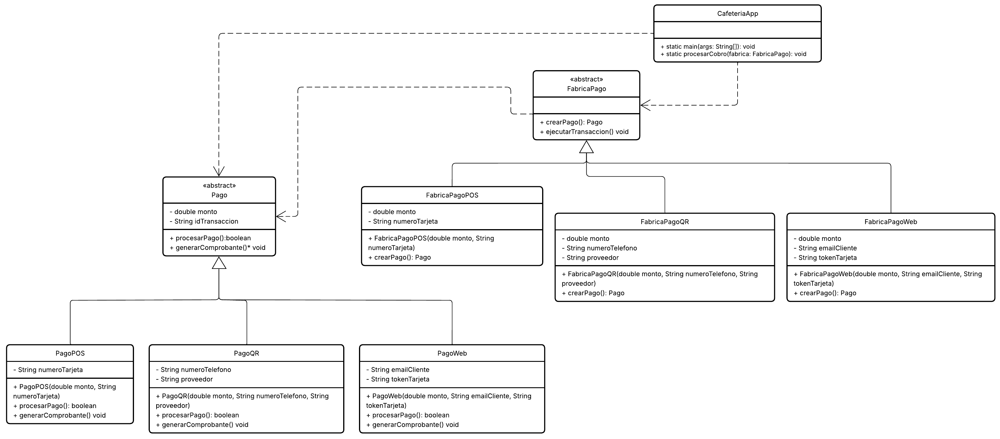

# PRACT_LAB_CAFEHACK
# Sistema de Procesamiento de Pagos Multicanal - CafeteriaApp

## Descripción del Problema
La cafetería "CafeHack" ha experimentado un crecimiento acelerado en sus ventas, permitiendo a los clientes realizar sus pedidos tanto en la caja física como a través de su aplicación móvil y plataforma web. Sin embargo, este crecimiento ha presentado un desafío técnico crítico en el módulo de cobros.

Actualmente, los pagos se procesan mediante tres canales diferentes:
1. **Pago por POS (Tarjeta Física):** Requiere conexión directa con la terminal del punto de venta y validación de PIN/chip.
2. **Pago por QR / Billetera Digital (Yape / PLIN):** Requiere la generación dinámica de un código QR y la confirmación en tiempo real del token de la transacción.
3. **Pago Web / Pasarela Online:** Requiere la integración con una pasarela bancaria externa mediante tokens de tarjeta de crédito/débito y verificación de seguridad (CVV / OTP).

### Problemática Técnica
El sistema anterior procesaba todos los pagos en una sola clase monolítica cargada de estructuras condicionales (`if-else` o `switch-case`). Esto generaba un **alto acoplamiento** y violaba el principio de **Abierto/Cerrado (Open/Closed Principle)**:
* Cada vez que se quería añadir un nuevo método de pago (por ejemplo, Apple Pay o Criptomonedas), se debía modificar la lógica central del sistema, arriesgándose a romper los métodos existentes.
* La inicialización de cada proveedor de pago exige parámetros específicos que ensucian el flujo principal del pedido.

### Solución Propuesta (Patrón Factory Method)
Para solucionar este problema, se implementará el patrón de diseño creacional **Factory Method**. 

* **Abstracción:** Se define una interfaz/clase abstracta común para los métodos de pago (`Pay`) y para la fábrica creadora (`FactoryPay`).
* **Desacoplamiento:** Cada canal de pago tendrá su propia fábrica concreta (`FactoryPayPOS`, `FactoryPayQR`, `FactoryPayWeb`), encargada exclusivamente de inicializar y construir el objeto de pago correspondiente.
* **Escalabilidad:** El cliente (la caja o la app de la cafetería) simplemente le pedirá a la fábrica correspondiente que procese la transacción, sin importar los detalles de bajo nivel de cómo se conecta cada pasarela.

# Diagrama Guia:

